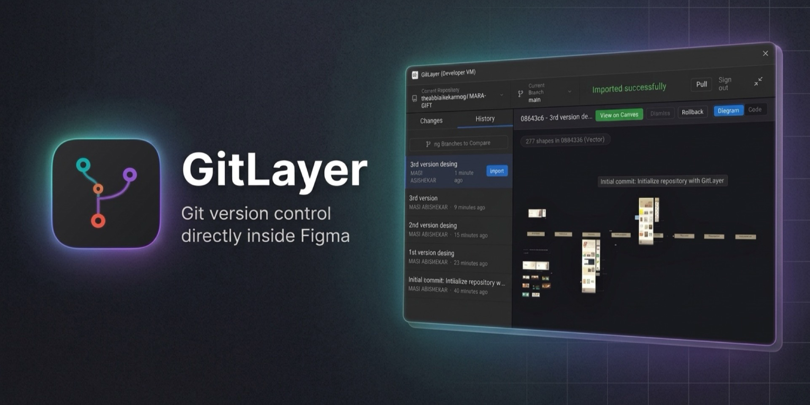

<div align="center">
  
  <h1>GitLayer</h1>
  <p><strong>Git-style version control directly inside Figma</strong></p>
</div>

GitLayer is a powerful Figma plugin that brings Git-style version control directly into the design workflow. It bridges the gap between design and development by allowing designers to commit serialized JSON snapshots of their Figma canvas directly to a connected GitHub repository.

## Features

- **GitHub Authentication**: Securely connect to your GitHub account using a Personal Access Token (PAT). Tokens are persisted locally for a seamless experience.
- **Repository & Branch Management**: Create new repositories or select existing ones, switch branches, and create new branches directly within Figma.
- **Branch Comparison**: Compare branches with real-time Ahead / Behind counters and commits matching GitHub Desktop.
- **Visual Diagram & Inspection**: View interactive diagram previews of historical commits and place previews directly beside your current canvas.
- **Dual UI Modes**: 
  - **Minimized Floating Toolbar**: A sleek, non-intrusive pill interface that hovers over your canvas for quick commits.
  - **GitHub Desktop Interface**: A maximized view that mirrors the GitHub Desktop experience, complete with history and branch comparison.
- **Live Sync**: Instantly watch your Figma nodes serialize into JSON in real-time as you drag, drop, and edit shapes on the canvas.
- **One-Click Commits**: Write a summary, add a description, and push your design snapshot directly to your branch without ever leaving Figma.

<p align="center">
  
</p>

## How it Works

When you commit, GitLayer recursively serializes the current Figma page and all of its nodes (Frames, Rectangles, Text, etc.) into a lightweight JSON structure. It then uses the GitHub REST API to create or update a `figma-snapshot.json` file in your linked repository.

## Development Setup

To run GitLayer locally on your machine and test it in Figma:

1. **Install Dependencies**
   ```bash
   npm install
   ```

2. **Build the Plugin**
   ```bash
   npm run build
   ```
   *Note: You must run the build command anytime you make changes to `code.ts`.*

3. **Load into Figma**
   - Open the Figma Desktop App.
   - Go to **Plugins** > **Development** > **Import plugin from manifest...**
   - Select the `manifest.json` file located in this repository folder.
   - Run the plugin!

## Tech Stack

- **Figma Plugin API**: Interacts with the canvas to read node properties (`code.ts`).
- **HTML / CSS / JavaScript**: Powers the user interface and handles network requests (`ui.html`).
- **TypeScript**: Ensures type-safety when interacting with Figma nodes.
- **GitHub REST API**: Used for fetching repositories, creating repos, and pushing commits.

## License
MIT
