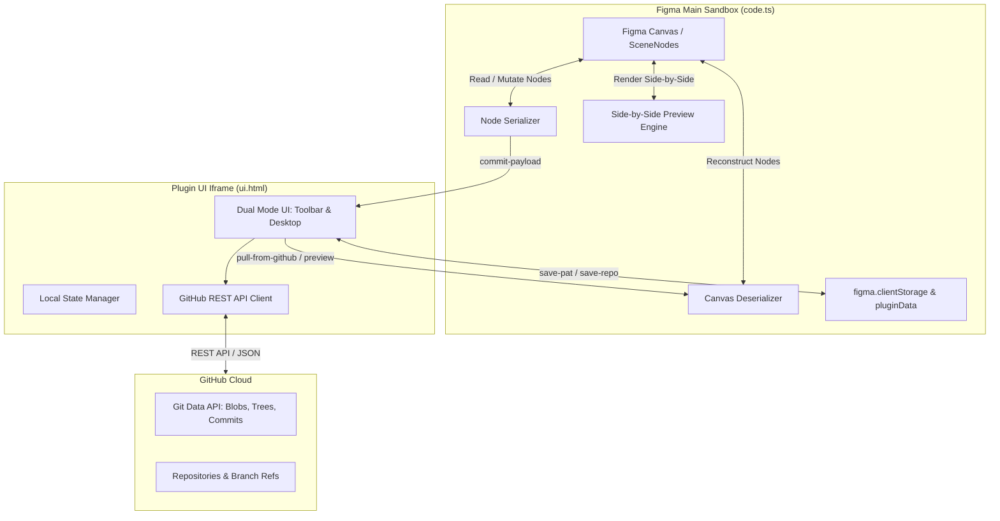

# Architecture & Technical Design

This document details the internal architecture, serialization engine, data models, and communication protocols powering **GitLayer**.

---

## System Architecture

Figma plugins execute in two isolated environments communicating exclusively via asynchronous message passing:



### 1. The Main Plugin Sandbox (`code.ts`)
- Runs in Figma's sandboxed JavaScript execution context.
- Has direct access to `figma.currentPage`, `figma.root`, scene nodes, fonts, and images.
- **Has no direct internet/network access**.
- Handles heavy computational tasks: serializing canvas nodes to JSON, parsing snapshot trees back into Figma nodes, preloading fonts, and rendering side-by-side preview frames.

### 2. The User Interface Iframe (`ui.html`)
- Runs inside an HTML5 `<iframe>` container.
- Has complete access to standard Web APIs, including `window.fetch`, DOM manipulation, CSS animations, and SVG rendering.
- **Cannot directly access Figma scene nodes**.
- Handles user interactions, manages the Dual UI modes (Minimized Pill vs. Maximized GitHub Desktop view), communicates with the GitHub REST API, and stores state in memory.

---

## Message Passing Protocol

All interactions between the UI and the Figma canvas occur via bidirectional messaging:

| Direction | Message Type | Purpose | Payload |
| :--- | :--- | :--- | :--- |
| `UI -> Main` | `save-pat` | Persists user's GitHub Personal Access Token | `{ pat: string }` |
| `UI -> Main` | `save-repo` | Binds active repo and branch to the Figma document | `{ repo: string, branch: string }` |
| `UI -> Main` | `logout` | Clears stored token and document repository links | None |
| `UI -> Main` | `resize` | Dynamically resizes the plugin modal window | `{ width: number, height: number }` |
| `UI -> Main` | `serialize-and-commit` | Requests snapshot serialization of current canvas | `{ pat, repo, branch, summary, desc, source }` |
| `Main -> UI` | `commit-payload` | Returns serialized snapshot ready for GitHub push | `{ payload: DocumentSnapshot, nativeSvg, message }` |
| `UI -> Main` | `pull-from-github` | Requests restoring canvas from remote JSON snapshot | `{ doc: DocumentSnapshot }` |
| `UI -> Main` | `import-commit-to-canvas` | Clones historical commit directly into active canvas | `{ doc: DocumentSnapshot, commit: object }` |
| `UI -> Main` | `preview-commit-on-canvas`| Renders historical commit beside active canvas | `{ doc: DocumentSnapshot, commit: object }` |
| `UI -> Main` | `dismiss-canvas-preview` | Cleans up temporary preview frames from canvas | None |

---

## The Serialization Engine

GitLayer serializes the active Figma page into an optimized JSON document representation (`figma-snapshot.json`).

### Captured Node Properties
The serializer (`serializeNode`) recursively walks through every node on `figma.currentPage`:
- **Identity & Transforms**: `id`, `name`, `type`, `visible`, `locked`, `x`, `y`, `width`, `height`, `rotation`, `opacity`, `blendMode`.
- **Fills & Paints**:
  - `SOLID`: RGB color (`r, g, b`), `opacity`, `visible`, `blendMode`.
  - `GRADIENT`: `GRADIENT_LINEAR`, `GRADIENT_RADIAL`, `GRADIENT_ANGULAR`, `GRADIENT_DIAMOND`, with transformation matrices and color stops.
  - `IMAGE`: `imageHash`, `scaleMode`.
- **Image Byte Inlining & Caching**:
  - Embedded image hashes are retrieved via `figma.getImageByHash(hash)`.
  - Image bytes are converted to base64 strings and stored in an `images` dictionary.
  - **Size Guard**: Individual images larger than **2MB** are skipped from embedding to prevent repository bloat and GitHub Git blob timeouts.
- **Strokes & Borders**: Stroke color, `strokeWeight`, `strokeAlign`, and dash patterns (`dashPattern`).
- **Corner Radii**: Uniform `cornerRadius` or individual corner array (`[topLeft, topRight, bottomRight, bottomLeft]`).
- **Effects**: `DROP_SHADOW`, `INNER_SHADOW` (with x/y offsets, radius, spread, and RGBA color), `LAYER_BLUR`, and `BACKGROUND_BLUR`.
- **Auto-Layout (Flexbox for Figma)**:
  - Container: `layoutMode` (HORIZONTAL / VERTICAL), `primaryAxisSizingMode`, `counterAxisSizingMode`, `primaryAxisAlignItems`, `counterAxisAlignItems`, `itemSpacing`, `paddingTop`, `paddingBottom`, `paddingLeft`, `paddingRight`, `clipsContent`, `layoutWrap`, `counterAxisSpacing`.
  - Child properties: `layoutAlign`, `layoutGrow`, `layoutPositioning` (ABSOLUTE / AUTO), `layoutSizingHorizontal`, `layoutSizingVertical`.
- **Typography**: Characters, font family, font style, font size, bold/italic flags, horizontal/vertical alignment, letter spacing, line height.
- **Vector Geometries**: Arc data for ellipses, polygon/star point counts, inner radii, and vector path strings.

---

## Canvas Deserialization and Restoration

When checking out a branch or pulling a previous commit (`deserializeDocument`):

1. **Font Preloading**: Scans the snapshot for all referenced font families and styles, asynchronously loading them via `figma.loadFontAsync()`. If a custom font is missing on the machine, it gracefully falls back to `Inter` (Regular / Bold).
2. **Node Instantiation**: Recursively creates Figma native nodes (`createFrame`, `createText`, `createRectangle`, `createVector`, etc.).
3. **Image Re-hydration**: Base64 image payloads stored in the snapshot are decoded and converted into Figma image fills via `figma.createImage()`.
4. **Layout Assembly**: Children are appended and auto-layout settings are applied from the parent down, ensuring high fidelity with the original design.

---

## Side-by-Side Canvas Previews

To prevent destructive accidental overwrites when exploring past versions, GitLayer features a non-destructive side-by-side canvas preview mechanism:

1. **Bounding Box Calculation**: GitLayer determines the total width and rightmost boundary of the designer's existing canvas elements.
2. **Offset Placement**: The historical commit is deserialized inside a distinct container frame (`__gitlayer_preview_<sha>`), positioned `200px` to the right of the current design.
3. **Preview Controls & Banner**: A persistent banner is placed above the preview frame displaying the commit message, author, timestamp, and interactive buttons:
   - **Dismiss**: Cleans up the preview frame immediately.
   - **Restore as Current**: Swaps the current canvas content with the previewed commit.

---

## GitHub REST API Integration

GitLayer interacts directly with the GitHub REST API (v3) using authenticated requests with Bearer tokens:

```text
Authorization: Bearer ghp_...
Accept: application/vnd.github.v3+json
```

### Key Endpoints Utilized:
- **User Validation**: `GET https://api.github.com/user`
- **Repository List**: `GET https://api.github.com/user/repos?per_page=100&sort=updated`
- **Create Repository**: `POST https://api.github.com/user/repos`
- **Branch Reference**: `GET https://api.github.com/repos/{owner}/{repo}/git/refs/heads/{branch}`
- **Create Branch**: `POST https://api.github.com/repos/{owner}/{repo}/git/refs`
- **Create Blob**: `POST https://api.github.com/repos/{owner}/{repo}/git/blobs`
- **Create Tree**: `POST https://api.github.com/repos/{owner}/{repo}/git/trees`
- **Create Commit**: `POST https://api.github.com/repos/{owner}/{repo}/git/commits`
- **Update Branch Pointer**: `PATCH https://api.github.com/repos/{owner}/{repo}/git/refs/heads/{branch}`
- **Fetch Commits**: `GET https://api.github.com/repos/{owner}/{repo}/commits?sha={branch}&per_page=30`
- **Compare Branches**: `GET https://api.github.com/repos/{owner}/{repo}/compare/{base}...{head}`

---

## Local Storage and Document Persistence

| Storage Mechanism | Key / Location | Data Stored | Scope |
| :--- | :--- | :--- | :--- |
| `figma.clientStorage` | `github_pat` | User's Personal Access Token | Local machine only; private to the user |
| `figma.root.setPluginData` | `github_repo` | Repository identifier (`owner/repo`) | Bound to the Figma document; shared with collaborators |
| `figma.root.setPluginData` | `github_branch`| Active branch name (e.g., `main`) | Bound to the Figma document; shared with collaborators |
