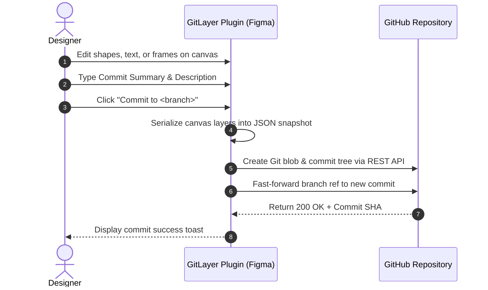

# GitLayer User Guide & Workflows

This guide covers day-to-day design version control workflows using GitLayer, including UI modes, branch management, committing changes, branch comparisons, and canvas previewing.

---

## Dual UI Modes

GitLayer is built with two distinct interfaces designed to balance focus while designing and power when managing versions:

### 1. Minimized Floating Toolbar (Pill Mode)
A compact 320x50px floating pill interface that sits unobtrusively in a corner of your Figma canvas:
- **Repository & Branch**: Glanceable view of the connected repo and active branch.
- **Quick Commit**: Clicking **Commit** opens a micro-popover where you can type a commit summary and description, then click **Push to <branch>**.
- **Expand Icon**: Clicking the expand button switches instantly to the full GitHub Desktop view.

### 2. Maximized View (GitHub Desktop Style)
An 840x600px comprehensive version control interface modeled directly after GitHub Desktop:
- **Top Navigation Bar**:
  - Current Repository selector.
  - Current Branch selector with branch switcher and branch creation modal.
  - **Pull** button: Pulls the latest remote snapshot from GitHub to update your active canvas.
  - **Collapse Button**: Returns to the Minimized Floating Toolbar.
  - **Sign out**: Disconnects your GitHub token and unlinks the repository.
- **Sidebar Tabs**:
  - **Changes Tab**: Inspect changed layers, stage modifications, write commit messages, and push.
  - **History Tab**: View commit logs, compare branches, and inspect or preview historical revisions.

---

## Committing Changes to GitHub

When working on a design, GitLayer tracks your changes in real-time.

### Writing Good Commit Messages
- **Summary**: Concise description of the change (e.g., `feat: updated checkout button colors to #0066FF`).
- **Description**: Detailed context, design decisions, or links to tickets/PRs.

---

## Branching Workflows

Working on feature branches lets you test experimental design changes without disrupting the `main` branch.

### Creating a New Branch
1. In the top bar, click on the **Branch** section (e.g., `main`).
2. A branch modal opens listing all branches in your repository.
3. Click **New Branch**.
4. Enter a branch name (e.g., `redesign-navigation` or `feature/dark-mode`).
5. GitLayer creates a new Git reference on GitHub pointing to the current commit and switches your Figma document to it.

### Switching Branches
1. Click the **Branch** selector.
2. Select any branch from the list.
3. GitLayer will fetch that branch's latest `figma-snapshot.json` and ask if you want to restore it onto the canvas.

> [!WARNING]
> Always commit or push your existing changes before switching branches. Switching branches and pulling a snapshot replaces existing canvas layers with the selected branch's design state.

---

## Comparing Branches (Ahead / Behind)

In the **History Tab**, GitLayer features branch comparison similar to GitHub Desktop:

1. Click the **History** tab in the sidebar.
2. At the top of the history list, click **Compare to branch...**.
3. Select a base branch (e.g., compare `feature/onboarding` against `main`).
4. GitLayer queries GitHub's compare API and displays:
   - **Ahead Counter**: How many commits your current branch is ahead of the target branch.
   - **Behind Counter**: How many commits your current branch is behind.
   - A filtered list of unique commits belonging to this branch.

---

## Canvas Previews and Time-Travel

One of GitLayer's most powerful features is **non-destructive visual previewing**:

### 1. Side-by-Side Canvas Preview
Want to see what the canvas looked like 10 commits ago without overwriting your current work?
1. In the **History** tab, select any historical commit.
2. Click **Preview Beside Canvas**.
3. GitLayer deserializes that specific commit snapshot and places it **directly to the right of your current canvas** in a labeled frame (`__gitlayer_preview_<sha>`).
4. A preview toolbar appears with two buttons:
   - **Dismiss Preview**: Removes the temporary preview frame from your canvas.
   - **Restore This Version**: Overwrites your canvas with this historical version.

### 2. Pulling Remote Changes
If a teammate pushed a commit to GitHub on the same branch:
1. Click the **Pull** button in the top navigation bar.
2. GitLayer retrieves the latest `figma-snapshot.json` from GitHub and updates your canvas layers.

---

## Signing Out and Switching Repositories

- To change the repository linked to the current document, click **Sign out** in the top right.
- This clears the stored token and resets the repository mapping, allowing you to select another repository or re-authenticate with a new Personal Access Token.
